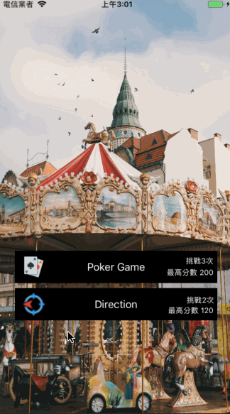

#  需求
將別人的遊戲以及自己的遊戲利用一個首頁結合起來，首頁畫面佈局如下：
1. 提供使用者選擇遊戲的功能。
2. 需要顯示「遊戲 icon」、「遊戲名稱」、「玩了幾次」、「歷史最高分」。

# 反思
過程中遇到的問題：
整合時不確定是否能直接利用別人專案中的檔案，所以就直接照著對方的版重新拉一次。

解決方法：
可利用 Storyboard Reference 來進行整合

# 畫面

