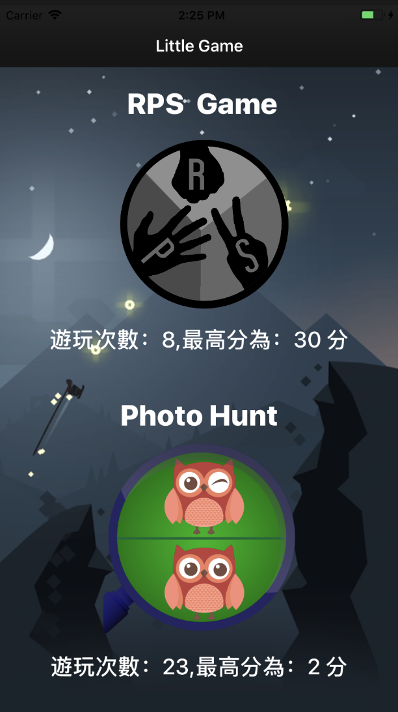
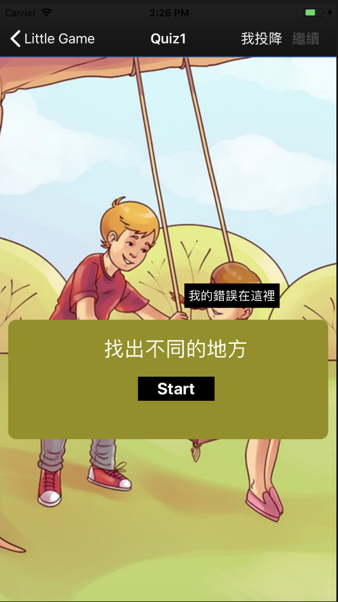
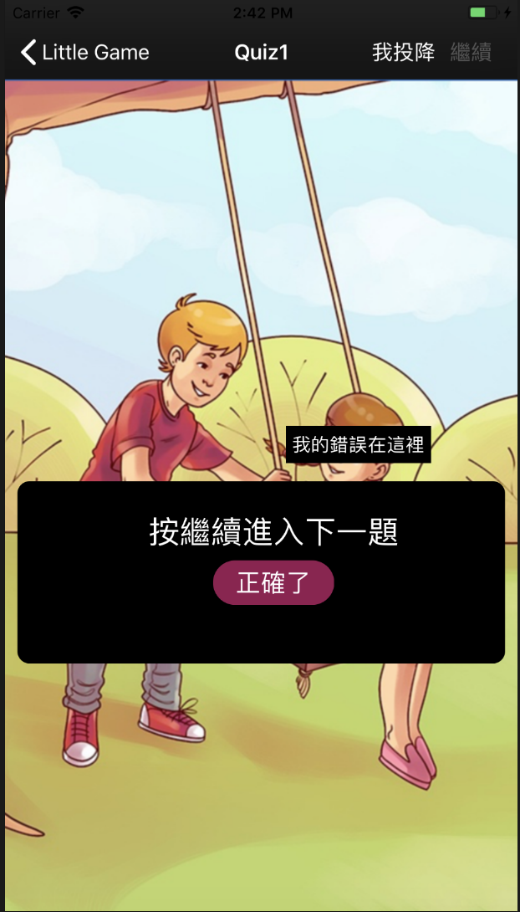

# Execrise box practice

## Little Game

* 遊戲主畫面

主畫面會紀錄兩種遊戲的最高分以及遊玩次數，點擊遊戲圖示即可進入遊戲畫面。

---

* RPS Game

每次程式會判斷這場要玩家 ”需要輸“ 或者 ”需要贏“，經由判斷之後玩家必須出拳達成所需要的獲勝條件，若失敗三次以上則會挑出重新遊戲的畫面。

---

* Photo Hunt Game

在圖片每個地方會有幾個不合邏輯的地方，玩家需要找出不合常理的地方，然後點擊它，如果跳出正確畫面。

## 心得

要結合不同開發者的專案，就必須思考另一個人的是用什麼方式來構築專案，以及要去理解他的邏輯判斷是在什麼時候，變數是在什麼時候被改變、調用或儲存。

例如需要知道遊戲最後結果的分數是哪個變數、怎麼傳值到 Result 的，可能就需要去了解什麼時候被存取；或是一個方法他其中可能包含了其他 function 或是連動，就需要一層一層下去解析。

