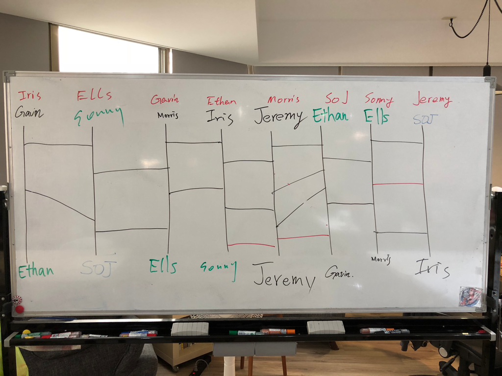

# 訓練盒 - 運氣是一種實力

## 簡介

2018年5月16日

延續昨天的任務，今天我們要把別人的遊戲整合到自己的遊戲中。

我們通過爬樓梯的方式來進行分組。

### Host

Don

### Members

Jeremy / Iris / Ells / Gavin / 菘駿 / Morris / Ethan / Sonny

----

## 爬樓梯

爬樓梯規則：

到場的朋友在八條直線的上下隨意各寫上一次自己的名字。

- 第一輪：八個人輪流畫上一條線。
- 第二輪：八個人輪流畫上一條線。
- 第三輪：Host 畫上三條線。

連線後的結果就是你需要整合的對象所做的遊戲，比如上圖中 Gavin 需要整合 Iris 的遊戲。

----

## 需求

- 增加一個首頁，需要有一張背景圖。
- 可以選擇你的遊戲和朋友的遊戲。
- 為你的遊戲和朋友的遊戲取一個名字。
- 畫面需要顯示「遊戲 icon」、「遊戲名稱」、「玩了幾次」、「歷史最高分」
- 紀錄整合過程中你碰到的問題，你是如何解決的。
- deadline 16:00 

