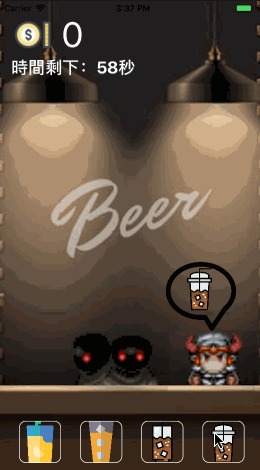

# 時間限時賽

現實生活中，你常常會接到一個任務卻有一堆雜事讓你不能單純把一件事情做好。
今天這個任務就是做一個遊戲，而這個雜事就是你要玩好一個遊戲。

雜事：下載「訓練盒」，10:00前解鎖 7個關卡，可以繼續下面的任務。

任務：做一個遊戲
- 有分數的機制，可以重新開始，要有動畫。
- 中午吃飯以前不能討論。
- 發現有做一樣規則的遊戲，需要協調否則都算 fail
- 專案必須要上 Github
- 如果有人勿操作 Git 把別人的專案弄掉了，直接 fail

# 來喝杯酒吧

歡迎來到"來喝杯"酒吧,客人會不斷進來點一杯酒,盡可能滿足客人吧
時間限時一分鐘,看你能得到多少分數

