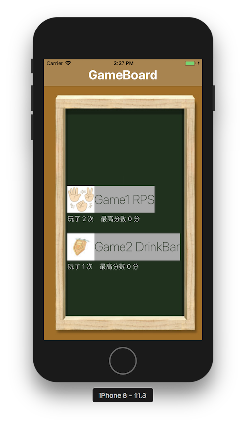
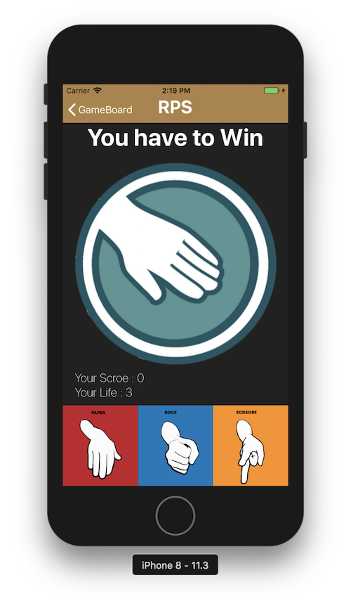
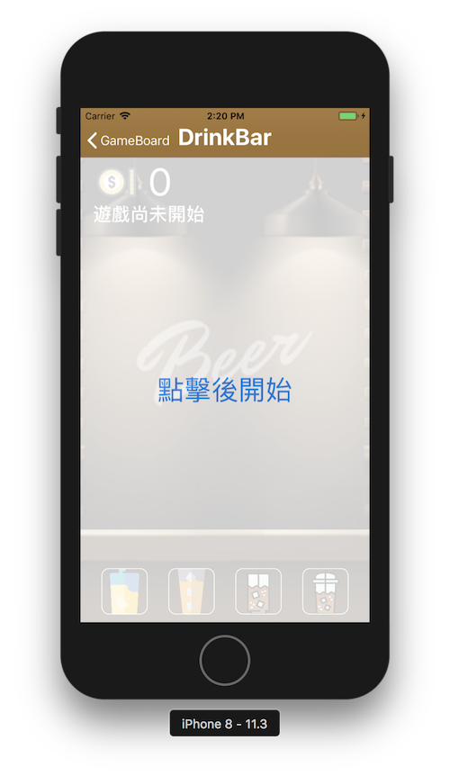

#  整合兩個小遊戲
這次作業是要結合自己和別人的小遊戲，透過一個首頁來控制要進入哪個小遊戲。

## 介紹你的 App 怎麼用 / 有什麼功能?
1. 新增一個首頁可以連結到兩個小遊戲
2. 每次都會更新遊玩次數及歷史最高紀錄

## 你在這次整合的過程中遇到了什麼問題、怎麼解決的?
Q1. Storyboard 無法共用：
 Ans: 土法煉鋼，重新在 storyboard 中重拉一個 Jeremy 的樣式

Q2. 兩個專案設定的版型不同：
 Ans: Jeremy 是用 iPhone 8 plus 的版型，而我是用 iPhone 8，所以部分畫面會跑版。除了重拉 AutoLayout 之外， Jeremy 遊戲中有一個圖片是用 code 控制位置，所以還要另外設定

Q3. 遊戲計算遊玩次數：
 Ans: Jeremy 的遊戲沒有開始按鈕，所以遊戲計數方面我是在玩家開始出拳的時候才判斷遊戲是否開始。相對的，我的遊戲本身就有一個開始按鈕，所以每次開始按鈕按下去後，無論玩家是否繼續玩，都計算遊玩一次。
