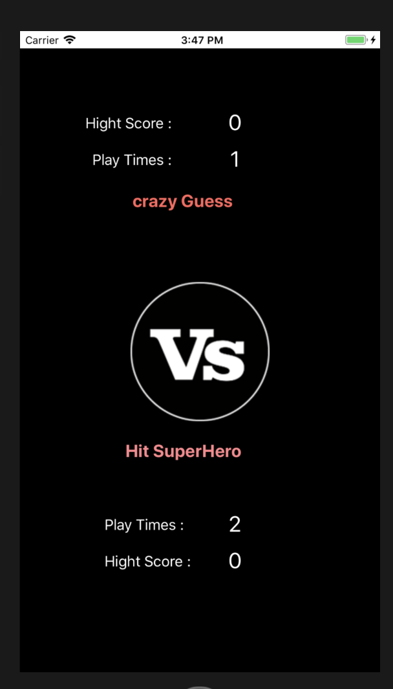

#  2 become 1
結合別人的小遊戲，整合成一個 APP

## 介紹你的 App 怎麼用 / 有什麼功能?
1. 首頁 可以顯示兩個遊戲的 "遊戲次數" & "最高分數"
2. 可由首頁進入遊戲

## 你在這次整合的過程中遇到了什麼問題、怎麼解決的?
Q1. Storyboard 無法共用：
Ans:  Rename 別人的 project，再加入自己的 storyboard 和 code 

Q2. 計算遊玩次數和最高分：
Ans: 使用 userDefault 存檔

#  <#Title#>

